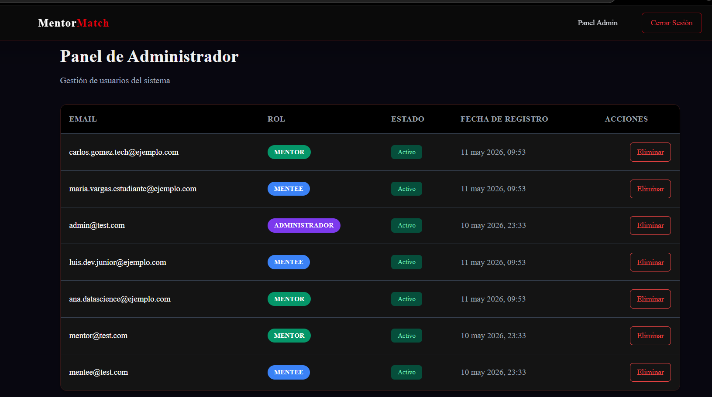
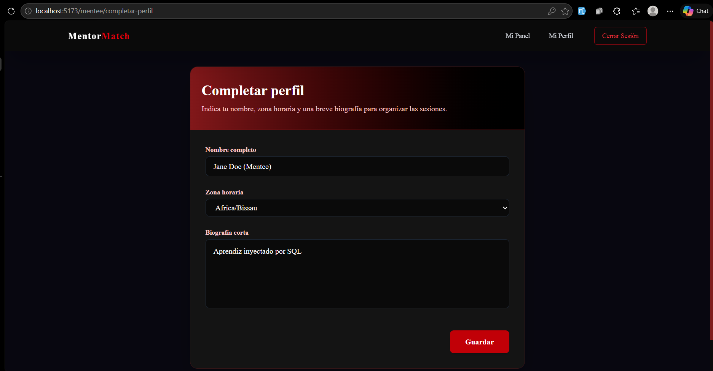
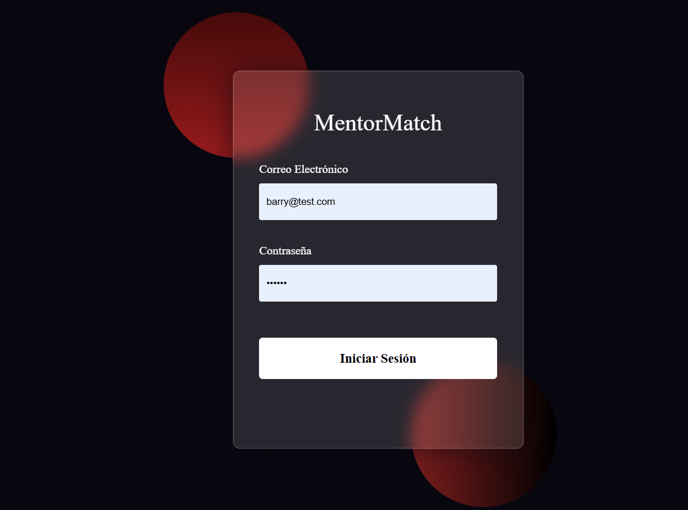

# Proyecto MentorMatch
## Integrantes
> Villca Villca Jhoel
> Herrera David Jesus
> Condori Carmona Fernando Favian

## Entregas: 
### Realizar el prototipo inicial para el caso de Uso Gestion de Usuarios
#### Casos de uso

Etapa 1: Registro, Autenticación y Perfiles
Caso de Uso 1: Registro de cuenta base

Actor Principal: Usuario (Anónimo)

Descripción: Un usuario se registra en la plataforma creando una identidad digital.

Reglas de Negocio: Requiere email y contraseña. El sistema asigna un UUID (id_usuario). El email debe ser único y la contraseña debe ser encriptada mediante hashing (Argon2id/bcrypt) antes de guardarse. El estado inicial de la cuenta es activo.

Caso de Uso 2: Asignación de Roles

Actor Principal: Sistema

Descripción: El sistema asigna roles específicos (Mentee, Mentor, Administrador) al usuario registrado para gestionar el Control de Acceso Basado en Roles (RBAC).

Reglas de Negocio: Un usuario puede tener múltiples roles de manera simultánea.

Caso de Uso 3: Configuración de Perfil Mentee

Actor Principal: Mentee (Aprendiz)

Descripción: El usuario aprendiz completa su perfil para poder interactuar en la plataforma.

Reglas de Negocio: Debe ingresar su nombre completo, biografía corta y zona horaria preferida. Si no especifica zona horaria, el sistema asigna UTC por defecto.

Caso de Uso 4: Creación y Verificación de Perfil Mentor

Actor Principal: Mentor / Administrador

Descripción: Un experto crea su perfil profesional para ofrecer sus servicios. Un administrador debe aprobarlo para que sea visible.

Reglas de Negocio: El mentor provee biografía, URL de video de presentación y URL de LinkedIn. El estado inicial es pendiente. No aparece en el catálogo ni puede vender paquetes hasta que un Administrador cambie su estado a verificado.

Caso de Uso 5: Acceso de Administrador

Actor Principal: Administrador

Descripción: Un usuario con rol de administrador ingresa a su panel de control para gestionar la plataforma.

Reglas de Negocio: Requiere un nivel de privilegio (entero ≥ 1) y un departamento asignado.

Etapa 2: Catálogo, Taxonomía y Búsqueda
Caso de Uso 6: Gestión de Categorías y Habilidades

Actor Principal: Administrador

Descripción: El administrador crea y estructura el árbol de categorías y habilidades disponibles en la plataforma.

Reglas de Negocio: Los nombres de categorías y habilidades deben ser únicos.

Caso de Uso 7: Autoevaluación de Habilidades del Mentor

Actor Principal: Mentor

Descripción: El mentor selecciona y registra las habilidades que domina para que aparezcan en su perfil.

Reglas de Negocio: Debe especificar los años de experiencia (≥ 0) y su nivel de dominio (basico, intermedio, avanzado o experto).

Caso de Uso 8: Publicación de Paquetes Comerciales

Actor Principal: Mentor

Descripción: El mentor crea ofertas o paquetes de horas con un precio fijo para ser contratado.

Reglas de Negocio: La cantidad de horas debe ser > 0 y el precio ≥ 0 (usando DECIMAL(10,2)). Se crean con estado activo por defecto.

Caso de Uso 9: Búsqueda y Descubrimiento de Mentores

Actor Principal: Mentee

Descripción: El aprendiz busca mentores en el catálogo utilizando filtros como habilidad, precio, zona horaria y disponibilidad.

Reglas de Negocio: El sistema solo muestra mentores con estado verificado y cuyos paquetes tengan el estado activo.

Etapa 3: Contratación y Pagos
Caso de Uso 10: Adquisición de Paquete (Generación de Contrato)

Actor Principal: Mentee

Descripción: El mentee selecciona un paquete de un mentor y procede a comprarlo.

Reglas de Negocio: Se genera un contrato en estado pendiente_pago. El sistema bloquea contratos duplicados idénticos en el mismo instante para el mismo usuario.

Caso de Uso 11: Procesamiento de Pago Externo

Actor Principal: Sistema / Pasarela de Pagos Externa (ej. Stripe)

Descripción: El sistema delega el cobro a una pasarela externa y escucha el resultado (webhook).

Reglas de Negocio: El backend NO retiene fondos. Solo guarda el monto, la moneda, el id_pasarela_externa (único, para evitar procesar el mismo pago dos veces) y actualiza el estado de la transacción.

Caso de Uso 12: Activación Automática de Contrato

Actor Principal: Sistema

Descripción: El sistema habilita el contrato de mentoría tras confirmar el pago.

Reglas de Negocio: Cuando el pago pasa a completado, el contrato cambia a estado activo atómicamente, permitiendo al mentee agendar horas.

Caso de Uso 13: Visualización de Recibo de Pago

Actor Principal: Mentee

Descripción: El mentee descarga o visualiza el recibo fiscal de su compra.

Reglas de Negocio: El backend no genera el recibo, simplemente expone en el frontend la URL pública del recibo (url_recibo_externo) generada por la pasarela de pagos.

Etapa 4: Agendamiento, Comunicación y Ejecución
Caso de Uso 14: Configuración de Disponibilidad

Actor Principal: Mentor

Descripción: El mentor define sus bloques de horarios recurrentes en los que está disponible para dar sesiones.

Reglas de Negocio: Se guardan los días de la semana y horas en estricto formato UTC. La hora de inicio debe ser obligatoriamente menor a la hora de fin.

Caso de Uso 15: Reserva de Sesión (Anti Double-Booking)

Actor Principal: Mentee

Descripción: El mentee escoge un horario disponible y agenda una sesión dentro de su contrato activo.

Reglas de Negocio: El sistema aplica bloqueo pesimista en la base de datos (SELECT FOR UPDATE) para garantizar que dos mentees no puedan reservar el mismo horario del mentor de forma simultánea.

Caso de Uso 16: Comunicación por Chat 1 a 1

Actor Principal: Mentee / Mentor

Descripción: Los usuarios utilizan una sala de chat privada para coordinar la sesión.

Reglas de Negocio: Solo puede existir una sala de chat única por cada par específico de Mentee-Mentor.

Caso de Uso 17: Ejecución de Videollamada

Actor Principal: Mentee / Mentor

Descripción: En la fecha y hora agendada, las partes ingresan a una sala de videollamada para llevar a cabo la mentoría.

Reglas de Negocio: El backend llama a una API de terceros (Zoom, Google Meet, Daily.co) para generar el enlace. La sesión pasa de estado programada a en_curso.

Caso de Uso 18: Seguimiento de Horas Consumidas

Actor Principal: Sistema

Descripción: El sistema descuenta las horas utilizadas del total del paquete contratado.

Reglas de Negocio: Tras finalizar una sesión, se incrementan las horas consumidas del contrato de forma atómica. Nunca pueden haber valores negativos.

Etapa 5: Calidad, Reseñas y Auditoría
Caso de Uso 19: Emisión de Reseña y Calificación

Actor Principal: Mentee

Descripción: El mentee evalúa el servicio brindado por el mentor al finalizar el contrato.

Reglas de Negocio: Solo se permite una única reseña por contrato (1 a 1). La calificación debe estar entre 1 y 5 estrellas.

Caso de Uso 20: Moderación y Reporte de Reseñas

Actor Principal: Administrador

Descripción: El administrador revisa y marca reseñas problemáticas o falsas.

Reglas de Negocio: La reseña cambia su flag a reportada = TRUE y puede ser ocultada de la vista pública.

Caso de Uso 21: Auditoría Administrativa Inmutable

Actor Principal: Sistema / Administrador

Descripción: El sistema registra un historial inmutable de acciones críticas ejecutadas por los administradores (como banear usuarios o verificar mentores).

Reglas de Negocio: Se guarda qué administrador realizó la acción, qué tabla fue afectada y en qué momento exacto (TIMESTAMP UTC). No se puede borrar este historial


#### CRUD de usuario
Para registrar un usuario para la regla de CREATE


Para eliminar a un usuario, que cumple con la regla de DELETE tambien el de READ.



Para la regla de UPDATE:
para MENTEE


para MENTOR


#### login de una cuenta de usuario
En este proyecto tenemos 3 tipos de usuario, que son:
ADMINISTRADOR, MENTEE, MENTOR



### Backend

nuestro backend tiene este arbol de archivos:
```text
backend/                           # Capa Servidor (FastAPI + SQLAlchemy)
│   ├── main.py                        # Entrypoint: Inicialización de la App y Rutas
│   ├── requirements.txt               # Manifiesto de dependencias Python
│   ├── .env.example                   # Plantilla de inyección de entorno
│   └── app/
│       ├── api/                       # Controladores de Endpoints (Meseros HTTP)
│       │   ├── admin.py               # Gestión RBAC y purga de usuarios
│       │   ├── auth.py                # JWT Issuance (Login/Signup)
│       │   ├── deps.py                # Inyectores: get_db, dependencias de roles
│       │   ├── disponibilidad.py      # Motor de agendamiento (Días/Horas UTC)
│       │   ├── paquetes.py            # CRUD de oferta comercial del Mentor
│       │   ├── profiles.py            # Gestión de perfiles Mentee/Mentor
│       │   └── skills.py              # Taxonomía y declaración de habilidades
│       ├── core/                      # Seguridad y Criptografía
│       │   └── security.py            # Hashing (bcrypt) y firma JWT (PyJWT)
│       ├── db/                        # Capa de Persistencia
│       │   └── database.py            # Engine de SQLAlchemy y SessionLocal
│       ├── models/                    # Modelos ORM (Mapeo a tablas SQL)
│       │   ├── associations.py        # Tabla intermedia usuario_roles
│       │   ├── main_models.py         # Tablas de negocio (Perfiles, Disponibilidad, etc)
│       │   └── usuarios.py            # Entidad core de identidad (Usuarios, Roles)
│       ├── repositories/              # Capa de Acceso a Datos (Consultas SQL/I-O)
│       │   ├── mentee_repository.py   # Consultas específicas de Mentee
│       │   ├── mentor_repository.py   # Consultas específicas de Mentor
│       │   └── user_repository.py     # Consultas core de Usuarios y Roles
│       ├── schemas/                   # DTOs de Pydantic (Validación de carga útil)
│       │   ├── admin.py               # Validación de respuestas de administración
│       │   ├── mentee_profile.py      # Validación de perfiles Mentee
│       │   ├── mentor_profile.py      # Validación de perfiles Mentor
│       │   ├── paquete_schema.py      # Validación de paquetes comerciales
│       │   ├── skills.py              # Validación de habilidades y niveles
│       │   └── user.py                # Validación de Auth y Tokens
│       └── services/                  # Capa de Lógica de Negocio (Cerebro)
│           ├── admin_service.py       # Lógica de listado de usuarios para admins
│           ├── auth_service.py        # Orquestación de autenticación y registro
│           └── profile_service.py     # Orquestación de creación/edición de perfiles
```

Se uso las tecnologias de 
* Python 3, FastAPI, SQLAlchemy, JWT

#### base de datos
* PostgreSQL 16 (con UUIDs nativos vía `pgcrypto`).


### Frontend

```text 
├── frontend/                          # Capa Cliente (React 19 + Vite 8)
│   ├── vite.config.js                 # Configuración de compilación y Proxy API
│   ├── src/
│   │   ├── App.jsx                    # Enrutador principal (Definición de Layouts y Rutas)
│   │   ├── AuthContext.jsx            # State management global (Sesión, Token y Rol decodificado)
│   │   ├── ProtectedRoute.jsx         # Middleware de protección de rutas (RBAC visual)
│   │   ├── components/                # Bloques de UI reutilizables (Legos)
│   │   │   ├── MainLayout.jsx         # Wrapper base con Navbar persistente y Outlet de rutas
│   │   │   ├── Navbar.jsx             # Barra de navegación inteligente con RBAC (Capa Interfaz)
│   │   │   ├── MentorAvailabilityPanel.jsx # Gestión visual de horarios
│   │   │   └── MentorSkillForm.jsx    # Registro visual de habilidades
│   │   ├── pages/                     # Vistas completas e independientes
│   │   │   ├── AdminDashboard/        # Panel de control con tabla de usuarios
│   │   │   ├── CompleteProfile/       # Formulario del perfil profesional (Mentor)
│   │   │   ├── Login/                 # Interfaz de acceso
│   │   │   ├── MenteeCompleteProfile/ # Formulario de datos personales (Mentee)
│   │   │   ├── MenteeDashboard/       # Vista principal del aprendiz
│   │   │   ├── MentorDashboard/       # Vista principal del experto
│   │   │   ├── Paquetes/              # CRUD visual de paquetes
│   │   │   └── Register/              # Captura de nuevos usuarios (Signup)
│   │   └── services/                  # Abstracción de red (Fetch API / Axios)
│   │       ├── adminService.js        # Comunicación con /api/admin
│   │       ├── authService.js         # Comunicación con /api/auth
│   │       └── profileService.js      # Comunicación con /api/profiles

```
Las tecnologias que se uso fueron
* React 19, Vite, Tailwind CSS, React Router
